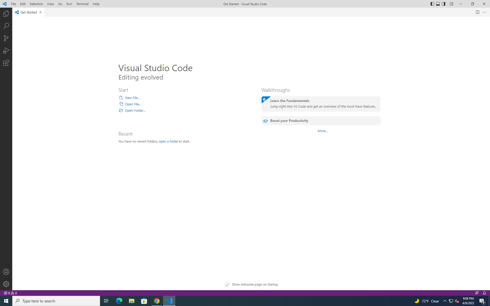
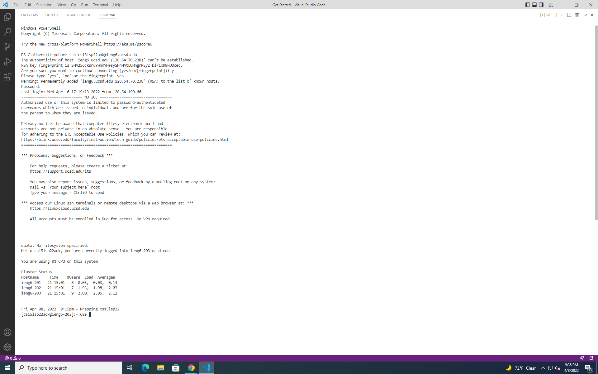
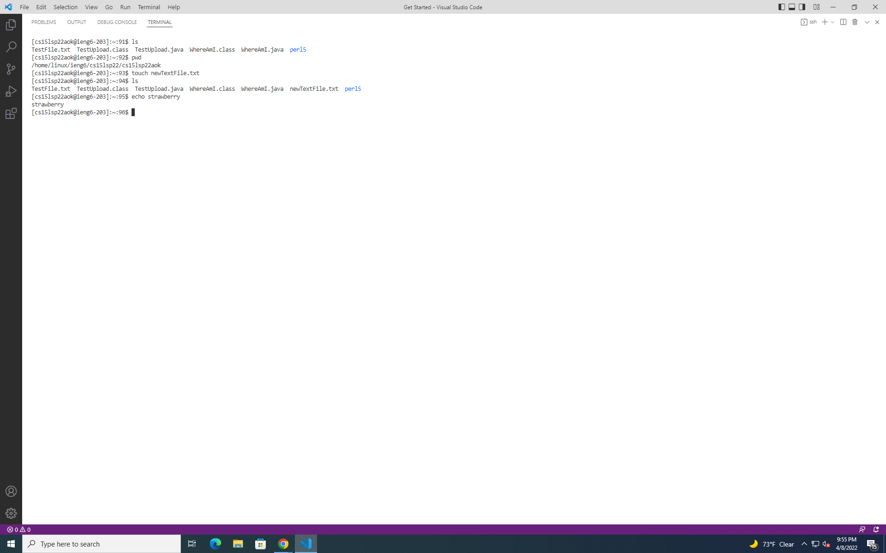
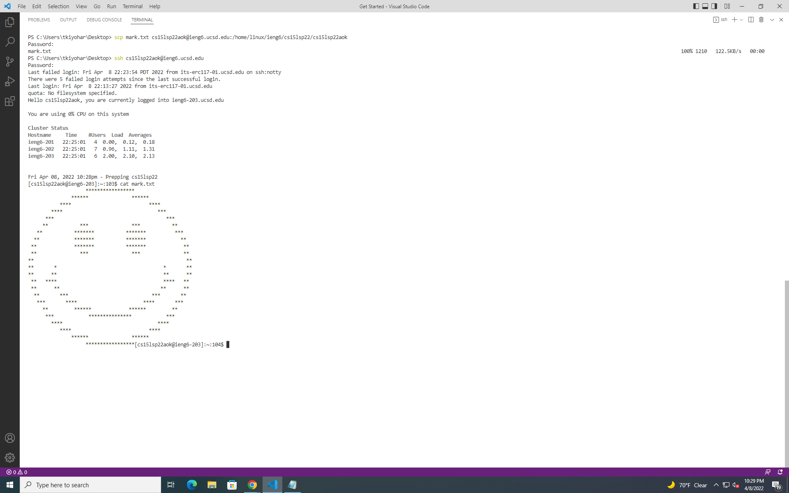
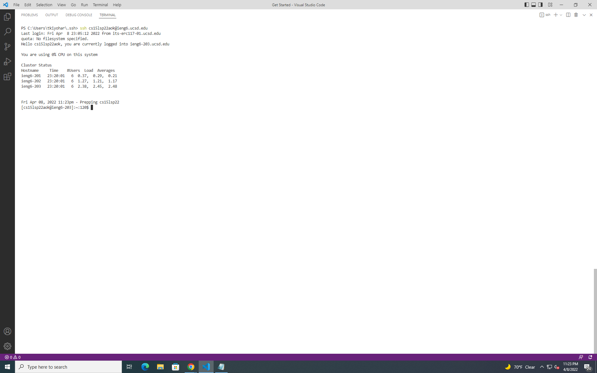
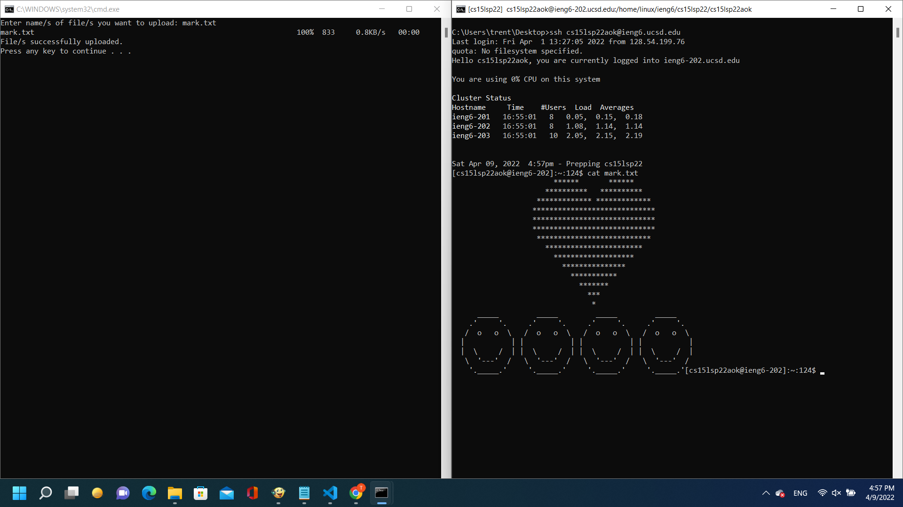
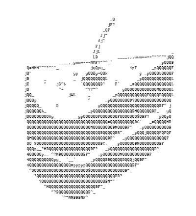

# HELLO INCOMING CSE 15L STUDENTS!

(and maybe my future self too if I went and forgot how to do this)

Today, we will be going through a basic tutorial on how to send files to other computers using the SCP method. For the sake of convenience—and following the instructions I was given for writing this tutorial—we will be running this program through VSCode, however, it is worth noting that all of the terminal commands we use are also usable in a regular command prompt.

However, before we begin this tutorial, it is worth mentioning a few things:
- This tutorial is intended for **WINDOWS USERS** (since I am a Windows user myself). Thus, if you’re following this tutorial on a mac, step 0 for you is to switch your computer to a Windows operating system and stop making bad OS choices from now on.
- This tutorial assumes that you have already set up a UCSD ieng6 account and that you can successfully access it; so if you don’t, step 0 (or 0.5 for Mac users) is to complain to your TA until they fix your stuff.
— *Pro tip*: the more you complain to your TAs, the faster they’ll help you

Anyway, with the ground rules in place, let’s get into the tutorial now, shall we?
<br/>
<br/>
## Contents:
1. Installing VScode
2. Remotely Connecting
3. Trying Some Commands
4. Moving Files with scp
5. Setting an SSH Key
6. Optimizing Remote Running
7. Conclusion
<br/>
<br/>
## Installing VSCode
---

Alright, here comes the first step in our quest to set up SCP remote file sharing across computers: I’ma need y’all to do the following:
1. Go to this [link](https://code.visualstudio.com/)
2. Press the big blue download button
3. Run the installer
4. Accept the terms of service without reading them (duh!)
5. Finish the setup for VSCode

At this point, you should be able to open VSCode to a screen that looks like this:



— *Pro tip*: If you selected “Darcula” as your preferred color scheme, you might be a vampire 🧛.
<br/>
<br/>

## Remotely Connecting
---
Okay, so now that you set up VSCode, we’ll be getting into the basics of connecting to your ieng6 computer account using the VSCode terminal:
1. Start by opening a VSCode terminal by clicking the “Terminal” tab in the dropdown menu bar at the top of the VSCode window and clicking “New Terminal”
2. Enter the following command:
  ```
  ssh <your ieng6 account>@ieng6.ucsd.edu
  ```
  
3. If you receive a message with a bunch of techno-jargon followed by a line asking “if you are sure you want to continue connecting?” input “yes.” This was just the computer trying to test your resolve and now that it knows you're worthy, it won’t second guess your commands again.
4. Enter your password and log in.

By this point you should’ve received a response in the terminal confirming that you’ve successfully connected to your ieng6 machine (see below for reference):


<br/>
<br/>

## Trying Some Commands
---
Y’all can get creative here, but here are some simple commands you can run on your ieng6 computer to make sure it's working:
- **ls** — lists all the files in the directory (minus hidden ones)
- **pwd** — prints the current working directory
- **touch \<filename.extension>** — creates a new file of the specified type
- **echo strawberry**—a highly advanced command that uses state-of-the-art algorithms to calculate what is scientifically the best ice cream flavor


<br/>
<br/>

## Moving Files with scp
---
So now that we know your ieng6 computer is working, we can get into how to copy files to it using the “Secure SHell protocol” (SSH).
1. While still connected in the terminal to your ieng6 account, copy the path of your home directory (the one you are initially sent to when you connect to your ieng6 computer) by typing the “pwd” command and copying its output (*Pro tip*: you can copy from the terminal by selecting the text you want to copy and right-clicking)
2. Disconnect from your ieng6 computer by entering “exit” in the terminal
3. Create a test file on your computer to send to your ieng6 computer using the SSH protocol. In my case, I’ll be sending “mark.txt” to my ieng6 computer since he has bravely volunteered for this test run.
4. Navigate to the directory of your test file using the “cd” command (see link for more info on how to use the cd command)
5. Run the following command
  ```
  scp <test file> <your ieng6 account>@ieng6.ucsd.edu:<path to your remote home directory>
  ```

Assuming you’ve done everything right, you should have received similar terminal output to the one below and now be able to view your test file in your home directory after reconnecting to your ieng6 computer:



(^ as we can see above, mark survived his SSH journey and is now living happily in my remote home directory)
<br/>
<br/>

## Setting an SSH Key
---
As you may have noticed, it's been a bit tedious having to reenter your password every time you want to remotely connect to your ieng6 computer.

>*If only there were a way for our ieng6 computer to remember us whenever we tried to connect to it from our specific computer.*


Enter— *stage left —SSH Keys; the smart person’s way of using ssh to connect to a remote computer without having to enter a password multiple times. To set up an SSH key, simply follow the steps below:
1. On your local computer, run the following command,
  ```
  ssh-keygen -t ed2551,9
  ```
  and press enter without entering anything on all the configuration prompts. This will create a public and private ssh key in the “.ssh” directory of your local machine (located in “C:\Users\\\<your username>\\.ssh”)
  
2. Navigate to your local .ssh directory and copy the “id_ed25519.pub” file to your remote computer using the scp transfer protocol
3. On your remote computer, create a new “.ssh” directory using the “mkdir .ssh” command.
4. Move your remote id_ed25519.pub file to your .ssh directory using the following command,
  ```
  mv id_ed25519.pub .ssh/authorized_keys
  ```
  (this will also rename the file to authorized_keys)
5. Enjoy not having to enter your password anymore whenever you want to connect to your remote computer from the local machine you set up an ssh key for (Look at the time saved below):


^*Wow!*

*Pro tip*: if you want to set up ssh keys for multiple computers, you can do so by adding the contents of each additional computers “.pub” ssh key file to the remote “authorized_keys” file on a new line.
<br/>
<br/>

## Optimizing Remote Running
---
Now that you’ve taken care of setting up an ssh key and are familiar with how to use the scp file transfer protocol, you may think we’ve reached a suitable place in optimizing our ssh experience. However, later in this course, when you begin having to repeatedly push new versions of files to your remote computer, you’ll again be met with repetitive tasks that practically beg to be automated (e.g., entering the entire scp command and target directory every time you want to save a file to your remote directory). Luckily, these tedious tasks can be automated by executing different, pre-written command list/s using a few simple “.bat” scripts. Here are a couple of the ones I found the most useful:

<br/>

<ins>Automatically Launching connected to your remote computer<ins/>
```
:: The following code opens a new terminal connected to your remote computer
ssh <your ieng6 account>@ieng6.ucsd.edu
```

<br/>

<ins>Automatically Launching connected to your remote computer<ins/>
```
:: The following code uploads any chosen files in the current directory to our remote dir
@echo off
set /p files="Enter name/s of file/s you want to upload: "
scp %files% <your ieng6 account>@ieng6.ucsd.edu:<path to your remote home directory>
echo File/s successfully uploaded.
pause
```

<br/>

Using our new .bat files, we can quickly check back in on our test file, mark.txt, for a quick update:



*^Look! He’s started a family!*
<br/>
<br/>

## Conclusion
---
Well, looks like you made it to the end of this tutorial—or at least, skipped ahead and got to this point while skimming it. Congrats on getting to the end of this tutorial (both to me and you), and I hope you found it informative, if not a bit entertaining as well. Cheers to you, and have a slice of cake, you earned it!


