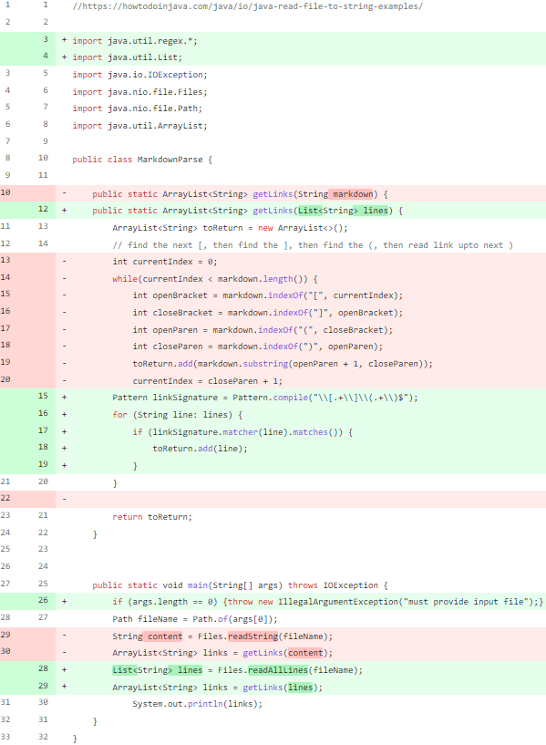
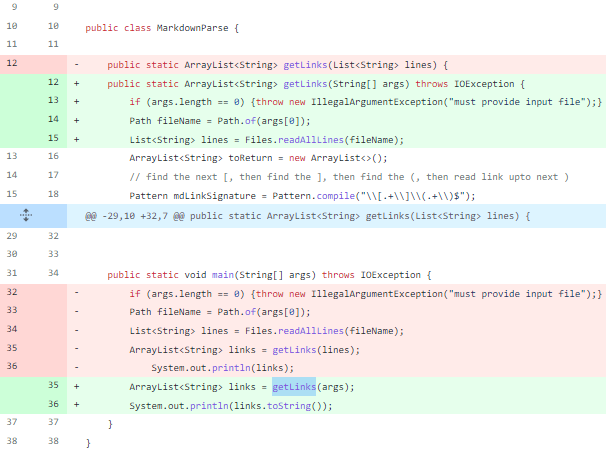
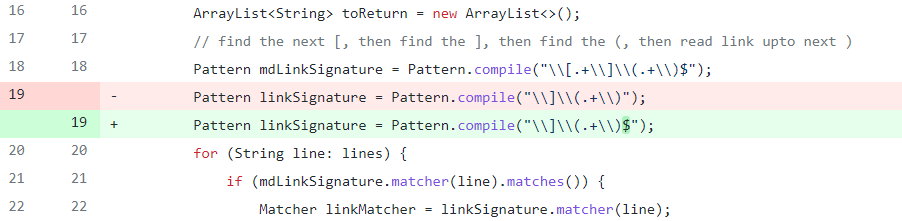

# **Lab Report 2**


## **Author’s Note/Introduction**

---

While writing my Markdown Parser program, I confirmed and documented three errors within the provided code (see below). However, I also noticed the potential for many more issues stemming from the way the code was originally written. To address the issues that I identified—as well as any others that I may have missed—I opted to rewrite the entire body of the code in a simpler and less error-prone manner using the “RE” (Regular Expression) Java package. Although I did not address the errors that I identified individually, I wrote my new code in consideration of each of their unique, error-causing aspects (which I will discuss below) and have included screenshots of the relevant git commits below.

<br/>

## **Git Commits**

---

### **1. “fixed program for all previous error files” (Committed on Apr 14, 2022)**

- This commit replaced the previous code with my own code for parsing links using the “RE” java package. Unfortunately, I’d forgotten to parse the links from the lines in this implementation, so my code was returning lines with links rather than the links themselves at this stage.



<br/>

### **2. “Changed link output to match correct notation” (Committed on Apr 21, 2022; Amended on Apr 24)**

- I don't know why github’s diff view displayed these changes so strangely (It displayed the entire code as re-written instead of just the change lines)
- In this commit, I added an additional section of code to parse the links from the lines it found them in to correct my output from the previous commit.


<br/>

### **3. “updated main file and made code compatible with tests” (Committed on Apr 21, 2022; Amended on Apr 24)**

- moved the processing that was done in the main method to the getLinks method so that I could more easily test the getLinks method using J-unit.



<br/>

### **4. “fixed pattern error + added tests for all test files” (Committed on Apr 24)**

- Fixed a regular expression error in my code and confirmed its functionality/correctness by testing it against all the error cases I had created



<br/>
<br/>

## **Failure Files**

---

### 1. [**Test-file-2.md**](https://github.com/tkiyohar/markdown-parser/blob/main/test-file-2.md)
**File Contents:**

```
# Title

[link1](never-gonna-give-you-up.html)

[link2](never-gonna-let-you-down.html)

[link1](never-gonna-run-arround.html)

[link2](and-desert-you.html)

:)
```

**Erroneous Output (ran on the provided parser code from before I replaced it):**

```
Exception in thread "main" java.lang.OutOfMemoryError: Java heap space
        at java.base/java.util.Arrays.copyOfRange(Arrays.java:3822)
        at java.base/java.lang.StringLatin1.newString(StringLatin1.java:769)
        at java.base/java.lang.String.substring(String.java:2709)
```

**Bug-Symptom-Input Relationship:**
	
- Input:
		Any file that does not end with a link
	
- Bug:
Code searches for links until it finds one at the end of the file (a condition that is not always the case).

- Symptom: 
the program goes into an infinite loop until it runs out of memory and crashes.

<br/>
<br/>

### 2. [**Test-file-3.md**](https://github.com/tkiyohar/markdown-parser/blob/main/test-file-3.md)
**File Contents:**

```
# Title

//The link below contains parentheses within the link
[link1](https://www.website.com/?utm_source=google%5BB%2B%5D&utm_medium=cpc&utm_content=google_ad(B)&utm_campaign=product)
[link2](https://www.zombo.com/)
```

**Erroneous Output (ran on the provided parser code from before I replaced it):**

```
[https://www.website.com/?utm_source=google%5BB%2B%5D&utm_medium=cpc&utm_content=google_ad(B, https://www.zombo.com/]
```

**Bug-Symptom-Input Relationship:**

- Input:
Links that contain parentheses

- Bug:
The code searches for the first instance of the link signature in a line, but does not care what else the line contains (e.g., the remaining part of a link with a closing parenthesis).

- Symptom: 
the program outputs only part of the link with a closing parenthesis.


<br/>
<br/>

### 3. [**Test-file-4.md**](https://github.com/tkiyohar/markdown-parser/blob/main/test-file-4.md)
**File Contents:**

```
# Title

BUY FISH!
\[0]( \[0]( \[0](

[link1](https://www.petco.com/shop/en/petcostore/category/fish/live-fish)
```

**Erroneous Output (ran on the provided parser code from before I replaced it):**

```
[ \[0]( \[0](
[link1](https://www.petco.com/shop/en/petcostore/category/fish/live-fish]
```

**Bug-Symptom-Input Relationship:**
	
- Input:
partial link signatures

- Bug:
The code searches for the signature of a link by parts which causes it to be triggered by any open brackets preceding the link.

- Symptom: 
the program misidentifies sections of the md file as links that are not links, and subsequently treats and outputs them as links.
