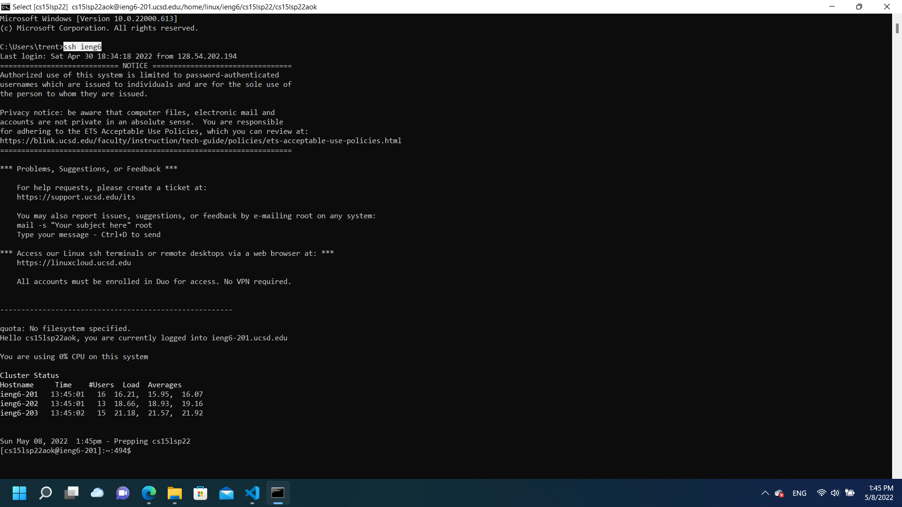

# **Lab Report 3**


## **Steamlining ssh Configuration**
---

### **- Show your .ssh/config file, and how you edited it (with VScode, another program, etc)**


This is my .ssh config file. I opted to just follow the directions and leave the host name as ieng6.


### **- Show the ssh command logging you into your account using just the alias you chose.**



This is me using my preconfigured host to ssh into my ieng6 account. It worked perfectly upon its first implimentation.

### **- Show an scp command copying a file to your account using just the alias you chose.**


This is me using the scp command with my new custom host name to transfer a file into my ieng6 home directory. I also learned that I could use ~ for my home directory path as long as I provided my ieng account correctly.

<br/>

## **Setup Github Access from ieng6**
---

### **- Show where the public key you made is stored on Github and in your user account (screenshot).**


This is my remote ssh public key on github (the key labled "ieng6 remote computer"). I also have two other ssh public keys for both my laptop and its bash evironment (having 2 keys is probably of poor-form/an inefficient solution, but it works).

### **- Show where the private key you made is stored on your user account (but not its contents) as a screenshot.**


This is where my private key is located in my remote ieng6 account (in its .ssh folder). I ended up using an rsa key instead of an id_ed25519 key for authentication because it allowed me to eliminate some possible error causes while I was troubleshooting it.

### **- Show running git commands to commit and push a change to Github while logged into your ieng6 account.**


This is me pushing a new test file to my markdownparser repository on github. As you can see from the code, there were no errors completing this task.

### **- Show a link for the resulting commit.**

[https://github.com/tkiyohar/markdown-parser/actions/runs/2290842338](https://github.com/tkiyohar/markdown-parser/actions/runs/2290842338)

<br/>

## **Copy whole directories with scp -r**
---

### **- Show copying your whole markdown-parse directory to your ieng6 account.**


This is me "scp"-ing my entire markdown-parser directory to my remote ieng6 account. As evidenced by my terminal output, it worked without a hitch.

### **- Show logging into your ieng6 account after doing this and compiling and running the tests for your repository.**


This is me compiling and running my tests on my ieng6 account. To make compiling and testing easier, I opted to just use the make file I wrote in lab 6 to run them.

### **- Show (like in the last step of the first lab) combining scp, ;, and ssh to copy the whole directory and run the tests in one line.**

<br/>

**--(NO IMAGE)--**

So this is a bit of a long story, but basically, after 3 hours of painful debuging, I determined that calling "ssh ieng6 \<javac or java + file you want to compile or run>" used a different version of java than calling "\<javac or java + file you want to compile or run>" when already "ssh"-ed into my ieng6 account. Unfortunately, this version of java was so old it didn't support the "Paths" part of the java.io package I was using in my code and it subsequently couldn't run or compile it without begin updated. I tried to update the jdk that the ssh branch was accessing using "sudo" commands from the terminal, but I couldn't do so because I'm not not an administrator. I then tried changing the ssh $JAVA_HOME environment variable to the the same one as the one that ran when I was already logged into my ieng6 account, but couldn't do that either due to access rights. In the end, I tried a few more atempts before accidentally wiping my account from the system after importing ~ 30+ junk files into my home directory, so now I'm just stuck hoping you have a backup of our directories :/

Anyway, so that why I don't have a picture to show for this part of the lab report, but if you'd like, here is the command I wrote to accomplish it:
```
scp -r markdown-parser ieng6:~ && ssh ieng6 "cd markdown-parser; make test"
```