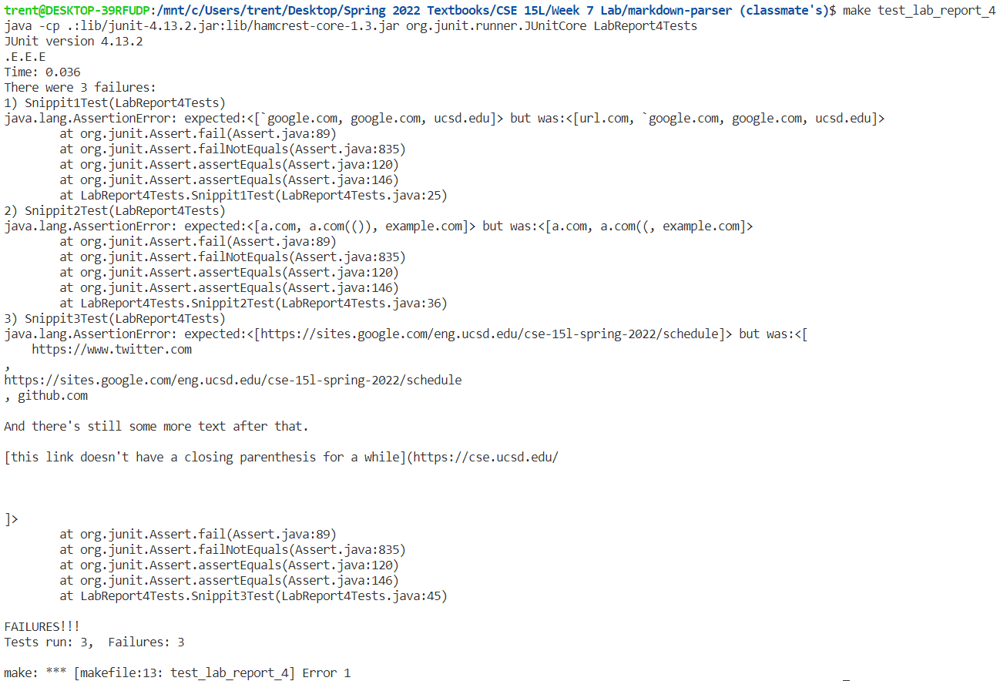
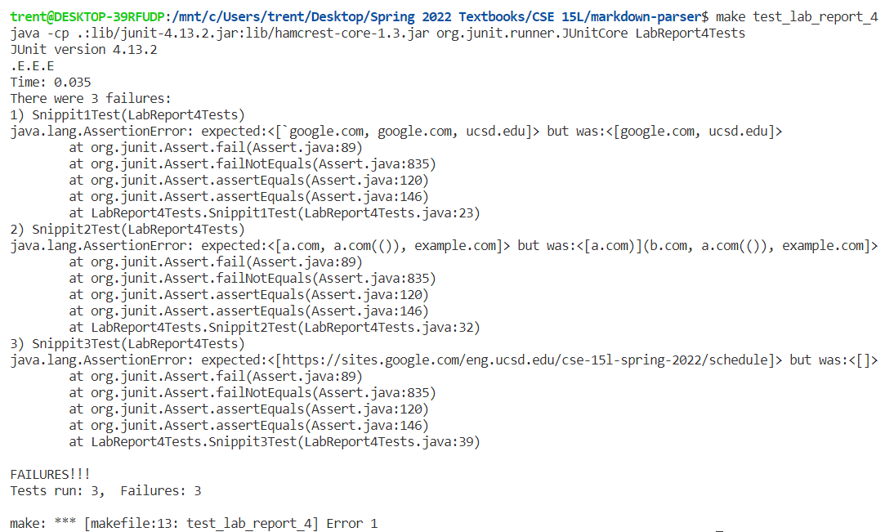

# **Lab Report 4**

<br/>

## **Classmate's Markdown_Parse Implimentation**
---
#### **[GitHub Repository](https://github.com/aHewig/markdown-parser)**

### **&nbsp; &nbsp; &nbsp; &nbsp; &nbsp; &nbsp; Results From Running Tests On Implimentation:**



--- ALL TESTS FAILED ---

<br/>

### **&nbsp; &nbsp; &nbsp; &nbsp; &nbsp; &nbsp; Code For Tests:**

- ### *makefile:*

```
# Trent Kiyohara's makefile
test: MarkdownParse.class MarkdownParseTest.class
	java -cp .:lib/junit-4.13.2.jar:lib/hamcrest-core-1.3.jar org.junit.runner.JUnitCore MarkdownParseTest

MarkdownParse.class: MarkdownParse.java
	javac MarkdownParse.java

MarkdownParseTest.class: MarkdownParseTest.java
	javac -cp .:lib/junit-4.13.2.jar:lib/hamcrest-core-1.3.jar MarkdownParseTest.java MarkdownParse.java

# Run Lab 4 Tests
test_lab_report_4: MarkdownParse.class LabReport4Tests.class
	java -cp .:lib/junit-4.13.2.jar:lib/hamcrest-core-1.3.jar org.junit.runner.JUnitCore LabReport4Tests

LabReport4Tests.class: LabReport4Tests.java
	javac -cp .:lib/junit-4.13.2.jar:lib/hamcrest-core-1.3.jar LabReport4Tests.java MarkdownParse.java
```

- ### *LabReport4Tests.java:*

```
// importing relevant libraries for use in code
import static org.junit.Assert.*;

import java.io.*;
import java.util.ArrayList;
import java.util.Arrays;
import java.util.List;
import java.nio.file.Files;
import java.nio.file.Path;

import org.junit.*;
// creating test class
public class LabReport4Tests {
    
    @Test
    public void Snippit1Test() throws IOException{
        ArrayList <String> expected = new ArrayList<>();
        expected.add("`google.com");
        expected.add("google.com");
        expected.add("ucsd.edu");
        Path fileName = Path.of("Snippet1.md");
        String content = Files.readString(fileName);
        assertEquals(expected, MarkdownParse.getLinks(content));
    }

    @Test
    public void Snippit2Test() throws IOException{
        ArrayList <String> expected = new ArrayList<>();
        expected.add("a.com");
        expected.add("a.com(())");
        expected.add("example.com");
        Path fileName = Path.of("Snippet2.md");
        String content = Files.readString(fileName);
        assertEquals(expected, MarkdownParse.getLinks(content));
    }

    @Test
    public void Snippit3Test() throws IOException{
        ArrayList <String> expected = new ArrayList<>();
        expected.add("https://sites.google.com/eng.ucsd.edu/cse-15l-spring-2022/schedule");
        Path fileName = Path.of("Snippet3.md");
        String content = Files.readString(fileName);
        assertEquals(expected, MarkdownParse.getLinks(content));
    }
}
```

<br/>

## **Personal Markdown_Parse Implimentation**
---
#### **[GitHub Repository](https://github.com/tkiyohar/markdown-parser)**

### **&nbsp; &nbsp; &nbsp; &nbsp; &nbsp; &nbsp; Results From Running Tests On Implimentation:**



--- ALL TESTS FAILED ---

<br/>

### **&nbsp; &nbsp; &nbsp; &nbsp; &nbsp; &nbsp; Code For Tests:**

- ### *makefile:*

```
# For running on local machine, use test_local
test_local: MarkdownParse.class MarkdownParseTest.class
	java -cp .:lib/junit-4.13.2.jar:lib/hamcrest-core-1.3.jar org.junit.runner.JUnitCore MarkdownParseTest

MarkdownParse.class: MarkdownParse.java
	javac MarkdownParse.java

MarkdownParseTest.class: MarkdownParseTest.java
	javac -cp .:lib/junit-4.13.2.jar:lib/hamcrest-core-1.3.jar MarkdownParseTest.java MarkdownParse.java

# Run Lab 4 Tests
test_lab_report_4: MarkdownParse.class LabReport4Tests.class
	java -cp .:lib/junit-4.13.2.jar:lib/hamcrest-core-1.3.jar org.junit.runner.JUnitCore LabReport4Tests

LabReport4Tests.class: LabReport4Tests.java
	javac -cp .:lib/junit-4.13.2.jar:lib/hamcrest-core-1.3.jar LabReport4Tests.java MarkdownParse.java
```

- ### *LabReport4Tests.java:*

```
// importing relevant libraries for use in code
import static org.junit.Assert.*;

import java.io.*;
import java.util.ArrayList;
import java.util.Arrays;
import java.util.List;
import java.nio.file.Files;
import java.nio.file.Path;

import org.junit.*;
// creating test class
public class LabReport4Tests {
    
    @Test
    public void Snippit1Test() throws IOException{
        ArrayList <String> expected = new ArrayList<>();
        expected.add("`google.com");
        expected.add("google.com");
        expected.add("ucsd.edu");
        assertEquals(expected, MarkdownParse.getLinks(new String[]{"Snippet1.md"}));
    }

    @Test
    public void Snippit2Test() throws IOException{
        ArrayList <String> expected = new ArrayList<>();
        expected.add("a.com");
        expected.add("a.com(())");
        expected.add("example.com");
        assertEquals(expected, MarkdownParse.getLinks(new String[]{"Snippet2.md"}));
    }

    @Test
    public void Snippit3Test() throws IOException{
        ArrayList <String> expected = new ArrayList<>();
        expected.add("https://sites.google.com/eng.ucsd.edu/cse-15l-spring-2022/schedule");
        assertEquals(expected, MarkdownParse.getLinks(new String[]{"Snippet3.md"}));
    }
}
```

<br/>

### **&nbsp; &nbsp; &nbsp; &nbsp; &nbsp; &nbsp; Personal Code Analysis Questions:**

**Do you think there is a small (<10 lines) code change that will make your program work for snippet 1 and all related cases that use inline code with backticks?**

- Yes. I know that there exists a < 10 line code change that will make my program work from snippet 1 because I implemented such a fix. Basically, I just modified the regex expressions I was using to detect lines with valid links to include links that had characters after the link (such as ` ). Then, I modified my line parsing script to remove these additional characters when obtaining the final link (3 lines of code changed in total).

**Do you think there is a small (<10 lines) code change that will make your program work for snippet 2 and all related cases that nest parentheses, brackets, and escaped brackets?**

- No, assuming that my program must also pass the snippet 1 tests (at least, not a clean solution). The reason for this boils down to the way markdown handles the priority of overlapping notations. In my current implementation, I would have to implement a needlessly complex regex expression to account for edge cases like nested links negating outer links, and so on. The problem may be solvable in 10 lines, but the solution would not be clean or easy to write/understand and would go STRONGLY against not only clean coding but basic coding decency (i.e., a 5 line regex expression of accounting for every edge case in an unintelligible jumble of letters and symbols).

**Do you think there is a small (<10 lines) code change that will make your program work for snippet 3 and all related cases that have newlines in brackets and parentheses?**

- No, at least not in a clean manner. For the same reasons a < 10 line solution should not be written for snippet 2, a < 10 line solution for snippet 3 would prove undesirable given my current implementation. Although it would admittedly be easier/cleaner to resolve than snippet 2, since I would only have to account for newline characters, accounting for all the places a newline character could appear in a valid link signature, and configuring nested or statements for the different types of newline characters that appear across platforms, would make the regex expressions extremely unintelligible and unwieldy. To address either or both of the issues identified by snippets 2 and 3, I would honestly probably opt to rewrite the entire body of the program rather than try to adapt it.