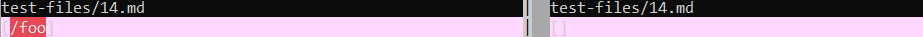
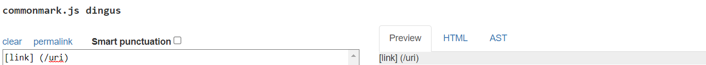
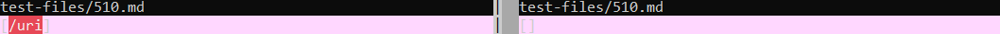

# **Lab Report 5**

## **Test Files Overview**
---
### - **How did you find the tests with different results?**

### I used "vimdiff" to highlight test files that produced different outputs across the instructor's and my markdownparser implementation (see screenshot below) before reviewing them manually to determine correctness.

### - **Links to test-files with different-results**

### **[14.md](https://github.com/nidhidhamnani/markdown-parser/blob/main/test-files/14.md)**

### **[510.md](https://github.com/nidhidhamnani/markdown-parser/blob/main/test-files/510.md)**

 

## **14.md**
---
### - **Correct implimenation: Personal Implimentation**
### - **Expected/Correct Output: [] --verified using commonmark (see below)**

### - **Output Comparison (Instructor version on Right; Personal version on Left)**

### - **Bug Description:**
### The starting "[" character in the link signature is omitted by a backslash invalidating the link signature. To fix this error, you could add checks after identifying your starting bracket, ending bracket, and ending parenthesis to ensure that none of them are preceded by a backslash (these checks could be added after the highlighted code below):

 

## **510.md**
---
### - **Correct implimenation: Personal Implimentation**
### - **Expected/Correct Output: [] --verified using commonmark (see below)**

### - **Output Comparison (Instructor version on Right; Personal version on Left)**

### - **Bug Description:**
### The "](" characters in the markdown link signature "\[\<text\>](\<link\>)" must be directly adjacent to each other. They can not be separated by any characters (including whitespace). To fix this error, you could add a check after the highlighted code in the image below to ensure that the indexes of "]" and "(" are adjacent to each other:
